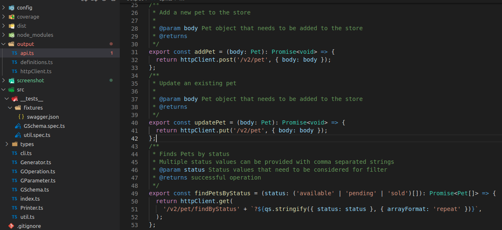

# @upace/swagger-to-ts

通过 swagger 文档生成 TypeScript 代码，支持 [swagger 2.0](https://swagger.io/specification/v2/)

生成代码结构如下：



国内可访问 [gitee 镜像](https://gitee.com/upace/swagger-to-ts)

## 特性
1. 尽可能兼容不规范的文档，definitions 使用中文或其他特殊符号定义时，转换成拼音和下划线
2. 不绑定特定 http client，内部实现了一个通用的 `httpClient`，外部可通过 `httpClient.handleRequest` 处理请求
3. 尽可能详尽的注释，有注释的字段都会生成 `jsdoc` 

## 使用

```bash
npm install @upace/swagger-to-ts --global
# 在线swagger
swagger-to-ts -s http://yourhost/api-docs -o output
# 本地swagger
swagger-to-ts -s ./swagger.json -o output
```

## 实现 httpClient

生成的代码使用自定义 httpClient，不会发送请求。在调用接口前你需要拦截处理，以下是示例

```ts
import httpClient from "./output/httpClient";

httpClient.handleRequest(async ({ method, url, body }) => {
  const res = await fetch(url, {
    method,
    headers: { "Content-Type": "application/json" },
    body: JSON.stringify(body),
  });
  return res.json();
});
```

## 参数

```
Options:
  -s, --swagger [swagger]       swagger路径或url
  -o, --output [output]         输入目录
  --exclude-tags [excludeTags]  排除指定tag，逗号分割
  --include-tags [includeTags]  只生成特定tag的接口,逗号分割
  --exclude-path [excludePath]  排除特定路径，支持正则
  --include-path [includePath]  只生存特定路径接口，支持正则
  --http-client-output [path]   httpClient输出路径，默认存于输出目录
  --config [config]             使用配置文件
  -h, --help                    display help for command
```

## 使用 swagger.config.js

除了使用命令行外，`swagger-to-ts` 还支持 `swagger.config.js` 进行更多配置


```bash
swagger-to-ts --config swagger.config.js
```

swagger.config.js 示例

```js
module.exports = {
  httpClientOutput: "output",
  swaggers: [
    {
      swagger: "swagger1.json",
      output: "output/swagger1",
      // type Filter = string | RegExp | FunctionFilter;
      excludePath: /internal/,
      includePath: /api/,
      excludeTags: "tag1,tag2",
      includeTags: () => true,
      // 重命名接口，注意需要拼接basePath
      rename: {
        '/api/order': {
          get: 'queryOrder'
        }
      },
      // 重写路径
      rewritePath: {
        '^/order': '/api/order'
      }
    },
    {
      swagger: "swagger2.json",
      output: "output/swagger2",
      // type Filter = string | RegExp | FunctionFilter;
      excludePath: (pathName, operation) => pathName.includes('internal'),
      includePath: /api/,
      excludeTags: "tag1,tag2",
    },
  ],
};
```
